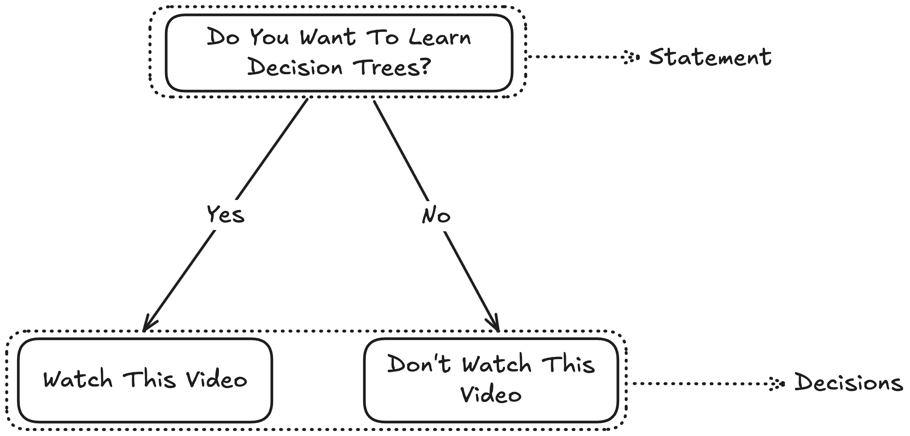
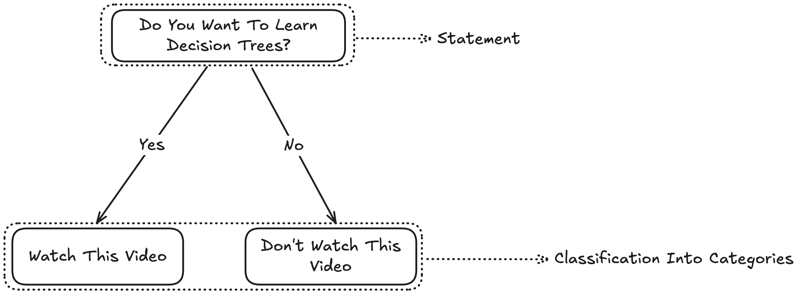
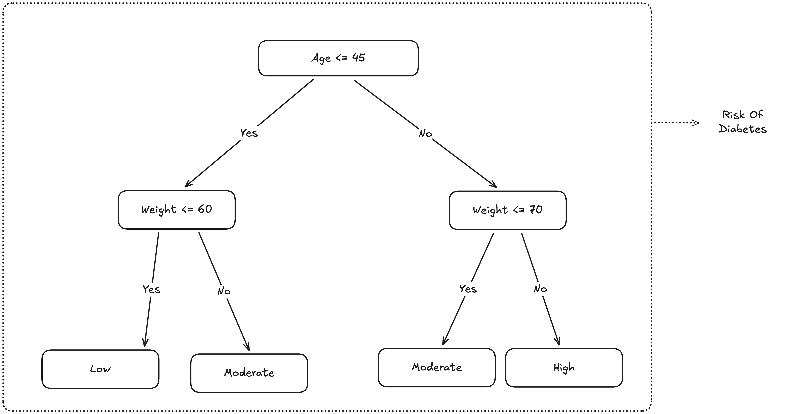
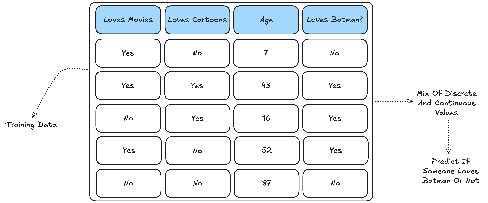

# WeakLearnr

## Decision Trees

Simplest Decision Tree

Classification Decision Tree

Regression Decision Tree

Simple Classification Decision Tree

Terminologies
- Root Node: Statement At The Start (Outgoing Decision Only)
- Intermediate/Internal Node: Incoming And Outgoing Decision
- Leaf Node: Final Value (Incoming Decision Only)

Training Data: Both Continuous And Discrete Data

## Resources
### Decision Trees
1. [What are decision trees?](https://www.youtube.com/watch?v=JwLKSCJmouU&list=PLPTV0NXA_ZSjXY1XnEmtyHN5do21KCgJR&index=1)
