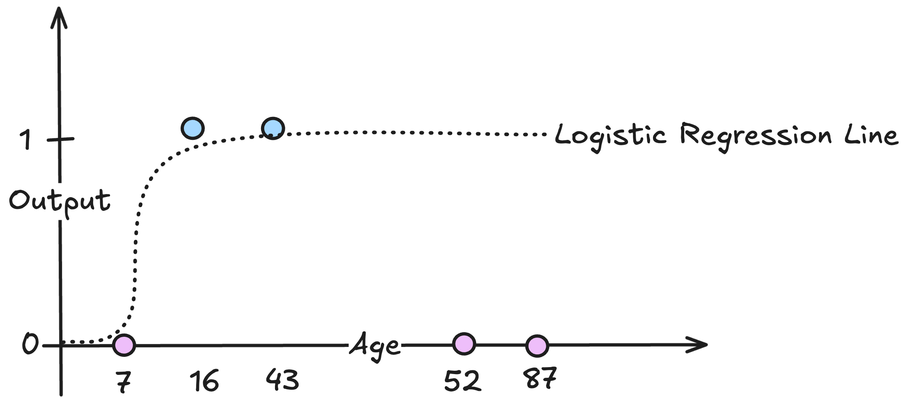
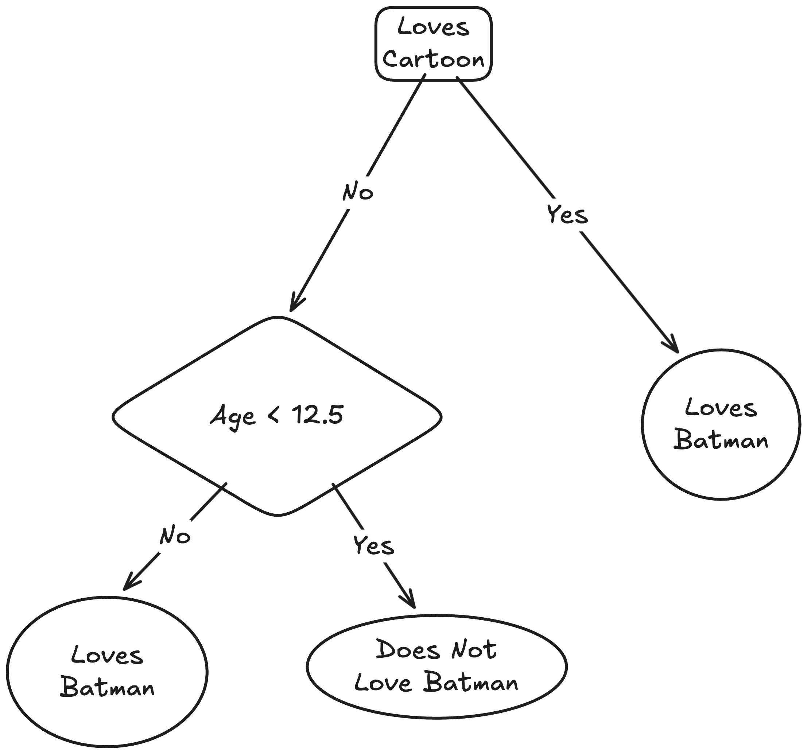
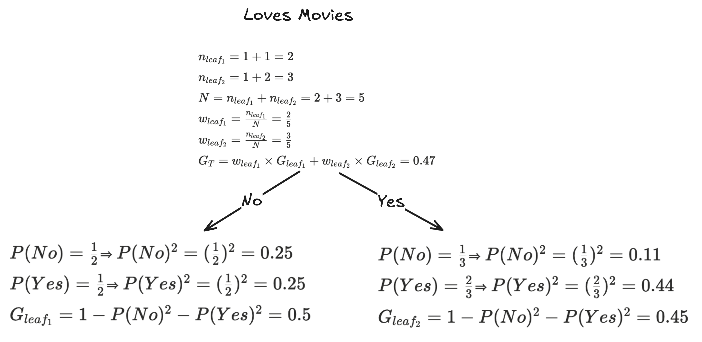
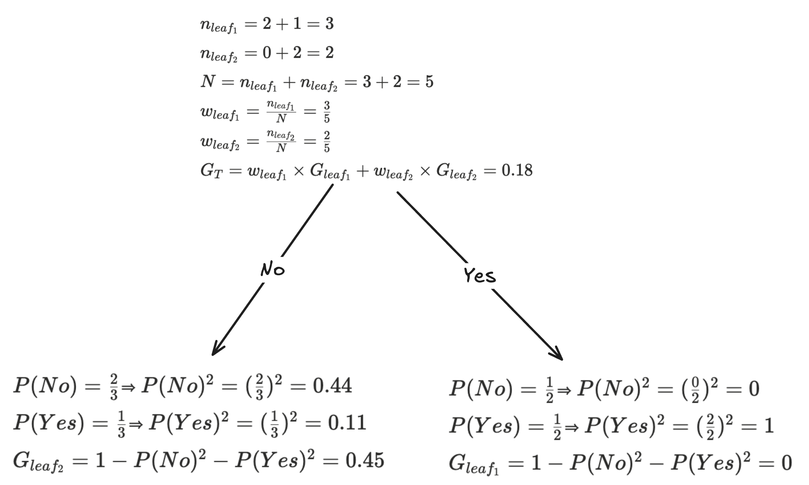
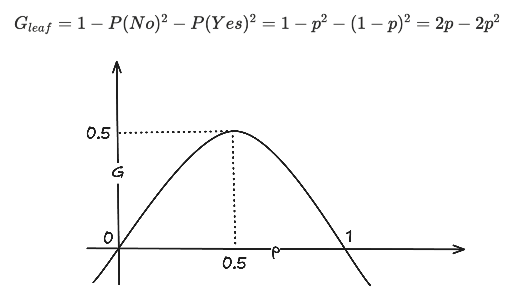

# WeakLearnr

## Decision Trees

Simplest Decision Tree

Classification Decision Tree

Regression Decision Tree

Simple Classification Decision Tree

Terminologies

- Root Node: Statement At The Start (Outgoing Decision Only)
- Intermediate/Internal Node: Incoming And Outgoing Decision
- Leaf Node: Final Value (Incoming Decision Only)

Training Data: Both Continuous And Discrete Data

Why Not Logistic Regression?

- Plotting Age Vs Output: Not Separable Using Logistic Regression

Sample Decision Tree For The Above Example

Purity Of Leaf Nodes

- Impure Node: Mixture Of Outputs
- Pure Node: Single Type Of Output
- Aim: Choose Statement With Highest Pure Node ("Loves Cartoon" Has More Pure Nodes Than "Loves Movies")

Gini Impurity

- Helps Quantify Leaf Node Purity
- $` G_{leaf} = 1 - P(No)^2 - P(Yes)^2 `$
- $` w_{leaf} = \frac{n_{leaf}}{N} `$
- $` G_T = w_{leaf_1} \times G_{leaf_1} + w_{leaf_2} \times G_{leaf_2}`$

 

Gini Impurity Visualisation

- The More Unequal The Probabilities, The More Pure The Leaf
- The More Equal The Probabilities, The More Impure The Leaf

## Resources
### Decision Trees
1. [What are decision trees?](https://www.youtube.com/watch?v=JwLKSCJmouU&list=PLPTV0NXA_ZSjXY1XnEmtyHN5do21KCgJR&index=1)
2. [Let us start building a decision tree!](https://www.youtube.com/watch?v=2_DQ-jsDqf0&list=PLPTV0NXA_ZSjXY1XnEmtyHN5do21KCgJR&index=2)
